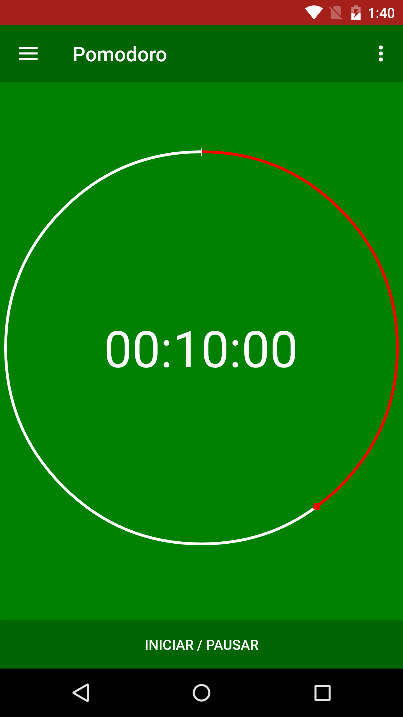
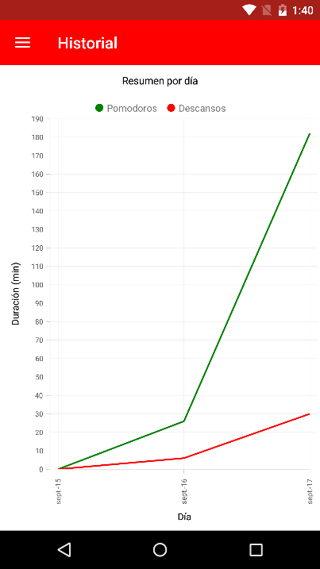

# Pomodoro [](https://appcenter.ms)

[]
[]

# Descripción 
Aplicación pomodoro realizada con Xamarin Forms para dispositivos android. Se creo con la finalidad de compartir el uso de algunas utilidades externas a Xamarin Forms las cuales son muy útiles y generan dudas en muchos, algunas de estas son:

- Syncfusion (Para realizar gráficos)
- Prims (Manejo de la navegación, eventos y servicios, mensajes)
- EF core (Para guardar en base datos)
- ObservableRangeCollection (Como optimización  de ObservableCollection)
- Integración con App Center (Manejo de errores, monitoreo, distribución etc)
- Multi-Lenguaje
- Manejo de audio

# Consideraciones
- Cuando ejecute la aplicación e ingrese a la parte de **historial** aparecerá un mensaje de licencia de syncfusion, si desea eliminar ese mensaje debe ejecutar el proceso que se indica en el mismo.

- En el caso que desee probar la integración con la app center debe crear una cuenta (tiene una versión gratuita) y agregar el token en archivo **App.xaml.cs** en la línea que indica a continuación: 
```
AppCenter.Start("android={android_token}", typeof(Analytics), typeof(Crashes));
```

# Limitaciones
Este aplicativo se hizo con una licencia de prueba de syncfusion, por lo cual si desea usar algunos de sus componentes debe acceder a una licencia.

# Contribuyendo
No dude en contribuir al proyecto adaptando o agregando características! Los informes de errores o solicitudes de extracción son bienvenidos.
